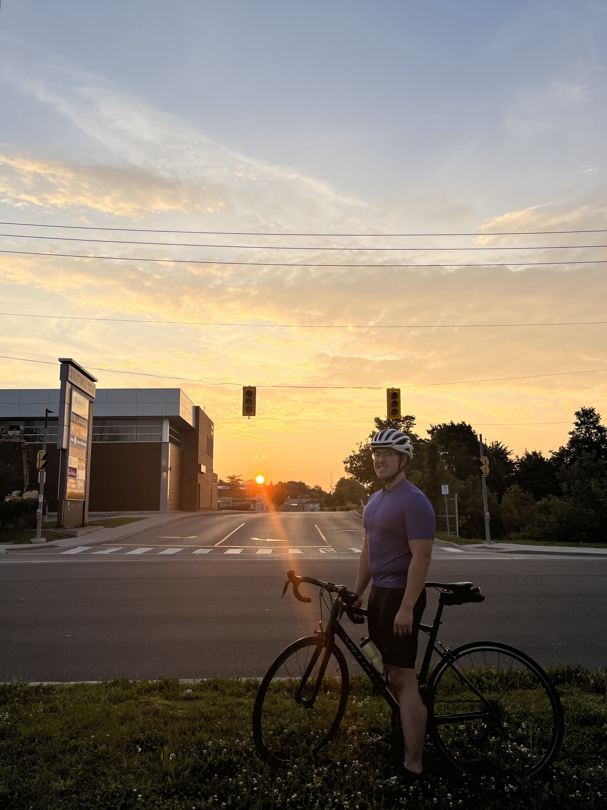
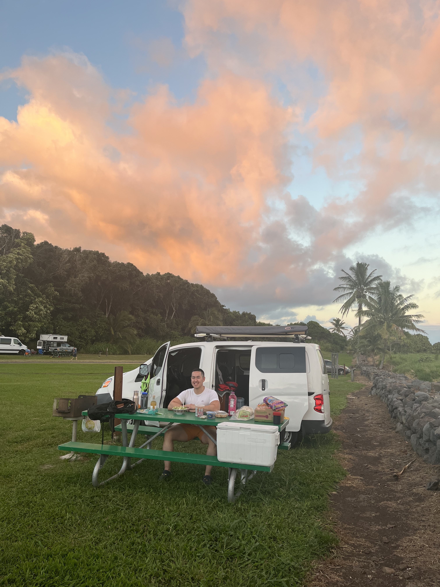
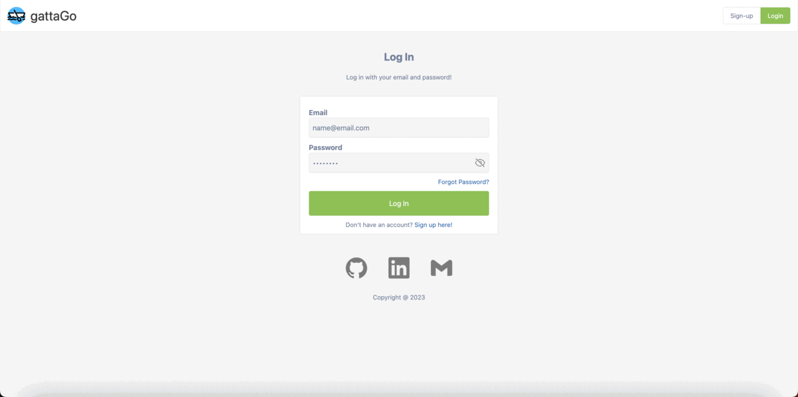
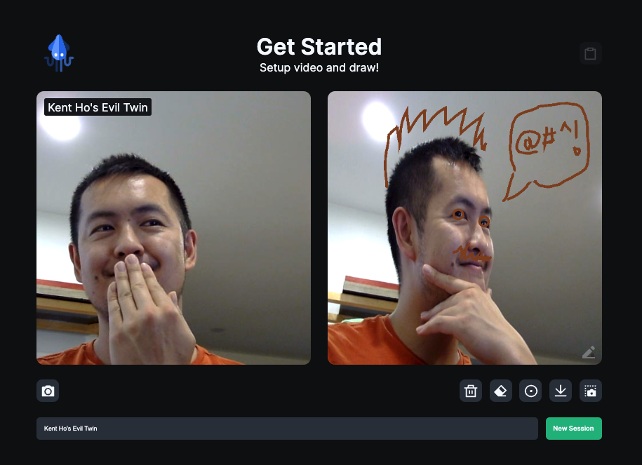

<h1 align="center">🌊 Hi, Kent here!</h1>

  
  
  
  
  

I am a mechanical engineer turned software engineer, and I'm all about honing a craft, achieving proficiency in said craft, and wielding it to tackle large obstacles and solve complex problems!

    
  
    

When I'm not at the keyboard, you can find me cycling around, picking up weights and putting them down, or unleashing boardgame chaos! If you still can't find me, I may be doing "field research" inside a camper van in the hopes of one day building my own!

<h2 align="center">🏗 Projects</h2>

<table bordercolor="#66b2b2" width="100%">
    <tr valign="top">
        <td width="50%" align="center">
            <h3>gattaGo</h3>
        </td>
        <td width="50%" align="center">
            <h3>Squiggled</h3>
        </td>
    </tr>
    <tr valign="center">
        <td width="50%" align="center">
            
        </td>
        <td width="50%" align="center">
            
        </td>
    </tr>
    <tr valign="top">
        <td width="50%" align="center">
             
        </td>
        <td width="50%" align="center">
            
        </td>
    </tr>
    <tr valign="top">
        <td width="50%">
            

                <strong>Stack:</strong> Typescript, React, TailwindCSS, Express, Prisma, MySQL
            

            

                <strong>Other Libraries:</strong> JWT, Mapbox, dnd-kit, chart.js
            

        </td>
        <td width="50%">
            

                <strong>Stack:</strong> React, SASS, Express            
            

            

                <strong>Other Libraries:</strong> Socket.io, Tippy
            

        </td>
    </tr>
    <tr valign="top">
        <td width="50%">
            

                gattaGo is a dragonboat racing team builder with dashboard display, athlete management, lineup assignment, and race plan crafting features.            

        </td>
        <td width="50%">
            

                Squiggled is peer-to-peer whiteboarding web application allowing users to capture, annotate, send and download screenshots from their device camera.            

                </td>
    </tr>
</table>

<h2 align="center">🧰 Skills</h2>

#### I have working knowledge in:

#### I'm exposed to:

<h2 align="center">📊 Github Stats</h2>

  
    

