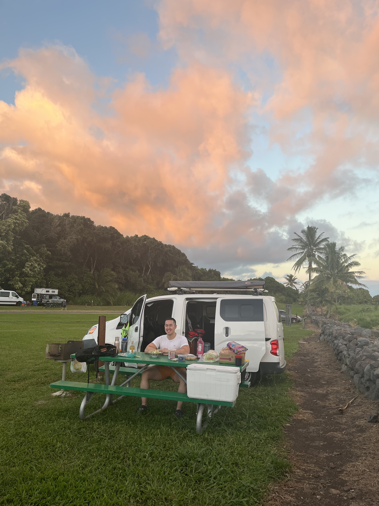
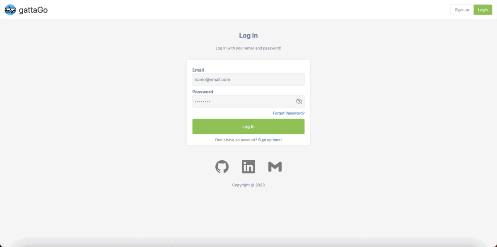
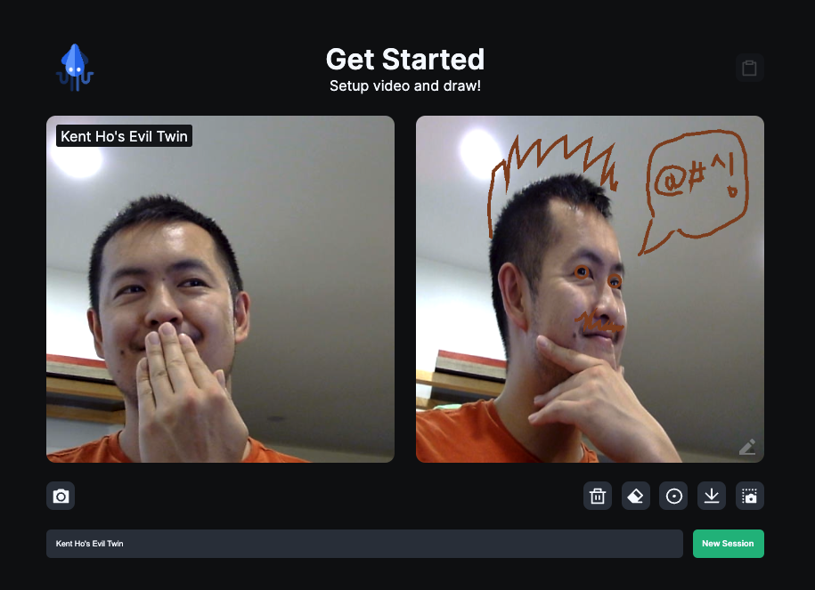

<h1 align="center">🌊 Hi, Kent here!</h1>

  
  

I am a mechanical engineer turned software developer. I bring a product-minded, collaborative and top-down approach to full stack development. I'm driven to automate workflows and reduce operational overhead to give people back their time!

<h2>🧰 Skills</h2>

#### My Tech Stack

#### Tools

  <!--  -->
    

<h2>ℹ️ About Me</h2>

    
  
    

When I'm not at the keyboard, you can find me cycling around or unleashing trading card chaos! If you still can't find me, I may be doing "field research" inside a camper van in the hopes of one day building my own!

<!-- <h2 align="center">💼 Experience</h2>

<table bordercolor="#66b2b2" width="100%">
    <tr valign="top">
        <td width="50%" align="center">
            <h3>gattaGo</h3>
        </td>
        <td width="50%" align="center">
            <h3>Squiggled</h3>
        </td>
    </tr>
    <tr valign="center">
        <td width="50%" align="center">
            
        </td>
        <td width="50%" align="center">
            
        </td>
    </tr>
    <tr valign="top">
        <td width="50%" align="center">
             
        </td>
        <td width="50%" align="center">
            
        </td>
    </tr>
    <tr valign="top">
        <td width="50%">
            

                <strong>Stack:</strong> Typescript, React, TailwindCSS, Express, Prisma, MySQL
            

            

                <strong>Other Libraries:</strong> JWT, Mapbox, dnd-kit, chart.js
            

        </td>
        <td width="50%">
            

                <strong>Stack:</strong> React, SASS, Express            
            

            

                <strong>Other Libraries:</strong> Socket.io, Tippy
            

        </td>
    </tr>
    <tr valign="top">
        <td width="50%">
            

                gattaGo is a dragonboat racing team builder with dashboard display, athlete management, lineup assignment, and race plan crafting features.            

        </td>
        <td width="50%">
            

                Squiggled is peer-to-peer whiteboarding web application allowing users to capture, annotate, send and download screenshots from their device camera.            

                </td>
    </tr>
</table> -->

<!-- <h2 align="center">🏗 Projects</h2>

<table bordercolor="#66b2b2" width="100%">
    <tr valign="top">
        <td width="50%" align="center">
            <h3>gattaGo</h3>
        </td>
        <td width="50%" align="center">
            <h3>Squiggled</h3>
        </td>
    </tr>
    <tr valign="center">
        <td width="50%" align="center">
            
        </td>
        <td width="50%" align="center">
            
        </td>
    </tr>
    <tr valign="top">
        <td width="50%" align="center">
             
        </td>
        <td width="50%" align="center">
            
        </td>
    </tr>
    <tr valign="top">
        <td width="50%">
            

                <strong>Stack:</strong> Typescript, React, TailwindCSS, Express, Prisma, MySQL
            

            

                <strong>Other Libraries:</strong> JWT, Mapbox, dnd-kit, chart.js
            

        </td>
        <td width="50%">
            

                <strong>Stack:</strong> React, SASS, Express            
            

            

                <strong>Other Libraries:</strong> Socket.io, Tippy
            

        </td>
    </tr>
    <tr valign="top">
        <td width="50%">
            

                gattaGo is a dragonboat racing team builder with dashboard display, athlete management, lineup assignment, and race plan crafting features.            

        </td>
        <td width="50%">
            

                Squiggled is peer-to-peer whiteboarding web application allowing users to capture, annotate, send and download screenshots from their device camera.            

                </td>
    </tr>
</table> -->

